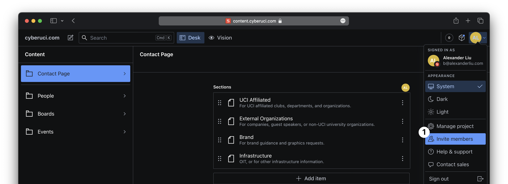
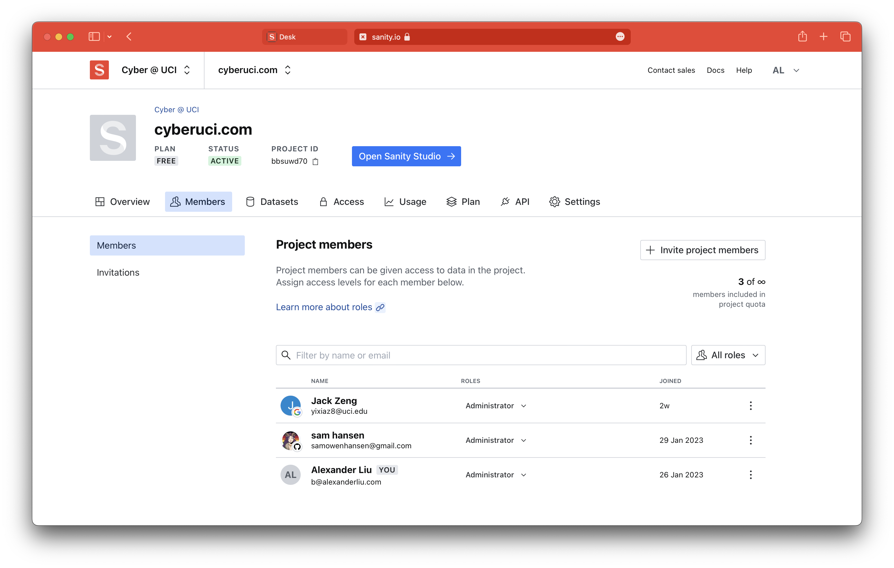

import { Steps, Callout } from "nextra-theme-docs";

# Adding New Members to Sanity Studio

<Callout type="info">
  This guide requires the `Administrator` role in Sanity.
</Callout>

## Video

  <iframe
    src="https://iframe.mediadelivery.net/embed/115566/6a29b511-f90b-4205-b903-7fd7fac60594?preload=true"
    loading="lazy"
    style={{
      border: "none",
      borderRadius: 8,
      position: "absolute",
      top: 0,
      height: "100%",
      width: "100%",
    }}
    allow="encrypted-media; picture-in-picture;"
    allowFullScreen="true"
  />

## Steps

{/* prettier-ignore */}
<Steps>

### Access the Members Page

Visit the [members page](https://www.sanity.io/organizations/o5yM828Kz/project/bbsuwd70/members) directly or access it via the dropdown menu on [Sanity Studio](https://content.cyberuci.com).

### Add User Details

<Callout type="warning" emoji="💡">
  Our plan allows for **3** non-admin users. Only invite users when necessary.
</Callout>

Click the "Invite project members" button to open a popup where you can enter the new member's email address and role.

### Send Invitations

After clicking "Send invites", Sanity will send invitations to the specified email addresses.
New members can join using an existing Sanity account or create a new one.

</Steps>
